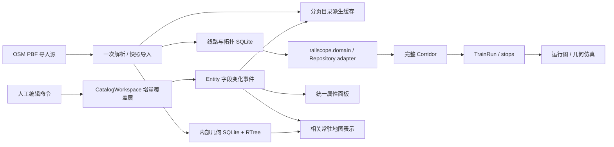

# 功能、模型、代码、UI 与视觉的对应关系

以下是当前代码与目标 UI 的映射；“目标 UI”不代表已经实现。产品含义见 [概览](PRODUCT_OVERVIEW.md)，行为见 [规格](FEATURE_SPECIFICATION.md)。

| 功能 | 数据模型 / 契约 | 当前代码归属 | 目标 UI 信息位置 | 视觉与反馈 |
|---|---|---|---|---|
| F01 数据与工作区 | DatasetSnapshot、DataSource、覆盖层、IdentityRegistry、conflict | `desktop/data_install.py`、`catalog_workspace.py`；`backend/railscope/identity.py`、`workspace.py` | 数据维护空间；文件 > 工作区 / 交换 | 来源 / 快照 / 未保存 / 错误标记，任务进度 |
| F02 地图图层 | 同一基础设施的 geometry 与 presentation DTO | `desktop/rail_store.py`、`metro_store.py`、`launcher.LocalHandler`、`assets/map.js` | 共享地图 + 图层 Dock | 类别制图、层级宽度、来源明确的边界、图例 |
| F03 查询与选择 | 领域 ID、来源别名、目录入口、唯一对象选择集 | `catalog_metadata.py`、`lazy_directory.py`、`rail_catalog_model.py`、`rail_station_catalog_model.py`、`launcher.py` | 全局搜索 + 结果 Dock；目录局部过滤 | 选中 / 多选计数、隐藏提示、定位反馈 |
| F04 设施编辑 | InfrastructureLine、NetworkEdge、Station、OperationalPoint、Yard、StationTrack、ServiceArea；人工 override | `rail_catalog_ui.py`、`line_metadata.py`、`rail_connection_ui.py`、`catalog_workspace.py`、`entity_refresh.py` | 基础设施目录 + 统一 Inspector + 专门编辑事务 | 类型符号、来源 / 核验徽标、字段错误、修改状态 |
| F05 完整通道 / 站内进路 | RouteIntent、Corridor、DirectedEdgeRef、StationRoute | `rail_ui.py`、`rail_line_store.py`、`domain_adapter.py`；`railscope.services.routing`、`repository.py` | 通道空间；有向全程列表 + 地图 | 方向箭头、参考 / 核验状态、断裂与禁用边标记 |
| F06 车次 | TrainRun、StopTime、TrainService、Platform、StopPosition | `desktop/operating_ui.py`、`rail_ui.py`、`operating.py`；`services/timetable/canonical.py` | 运行计划空间；车次、停站表、站场引用 | 停车 / 通过、到发列、核验进路与异常行 |
| F07 运行图 / 仿真 | EffectiveRun、TrackOccupancy、Conflict、DispatchScenario 等实际能力 | `operating_ui.py`、`rail_ui.py`；`services/simulation/geometry.py`、`timetable_validation.py` | 运行图空间；时间轴 + 图表 + 地图 | 当前时刻、车次选择、播放状态、冲突来源 |
| F08 样式与输出 | presentation、rail_semantics、style key、导出 DTO | `rail_style_resolver.py`、`rail_style_ui.py`、`display_names.py`、`station_schematic.py`、`components.py` | 显示 > 制图样式；文件 > 输出；帮助 | 集中 token、分类图例、输出注记 |

文件路径以仓库根目录为基准。领域对象定义在 `backend/railscope/domain.py`；Desktop SQLite 与 Backend Repository 都是其适配器。上表列出领域对象不等于所有调度业务已经在 UI 实现。

## 当前调用边界

目录缓存和地图 presentation 是可重建视图，不能成为长期业务身份权威。人工覆盖、基础设施、Corridor 与 TrainRun 有各自职责。

## 本次建立的变化契约

| 变化入口 | 持久化 / Undo | 依赖事件 | 消费方 |
|---|---|---|---|
| `save_station_override` | `CatalogWorkspace.update` 按 station owner | `entities_changed`，必要 placement / visibility | materialised record、车站分页模型、详情、地图常驻表示 |
| `save_overrides` | 按线路 / 区间 owner；assembly 展开保留 | 字段 delta；结构变更保留专门刷新 | 目录标题 / 搜索、运行库 metadata、地图表示 |
| `undo_catalog` / `redo_catalog` | 同一持久化入口，成功后移动历史栈 | 与正向修改同一种字段 delta | 同一消费方，恢复原 presentation |
| 导入 / 成员 / 拓扑重建 | 现有专门工作流，不能伪装为普通属性编辑 | 快照 / 结构失效 | 派生目录、路径校验、空间几何，后台准备 |

`entity_id` 列在覆盖库中保存现有 editor owner key；这里的 station source alias 仍是兼容 ID。后续需由 IdentityRegistry 映射统一领域 ID，不能把列名当作已经完成身份迁移的证明。

## 结构重构边界

目标模块：`WorkbenchShell` 管布局与入口；`CommandRegistry` 管动作、快捷键与作用域；`SelectionController` 管唯一选择集合；`InspectorController` 管统一设施表单；`WorkspaceController` 管布局预设；`EntityChangeDispatcher` 管依赖失效；Repository adapters 管持久化。

这些是建议职责名，不是新建第二套业务对象。可先从 `Desk` 提取 UI 控制器并保持原入口调用；禁止在 UI 重构中重新定义 Corridor / TrainRun。字段变化事件必须持续保持与数据模型、UI位置和视觉状态的对应关系。

## 跨文档核对

- 新功能先登记 F 编号 / 领域对象，再给代码 owner 和 UI 入口，最后决定符号与样式。
- `DESIGN_SYSTEM.md` 中每一种铁路符号必须对应模型类型或带来源的显示 DTO。
- `UI_ARCHITECTURE_PROPOSAL.md` 的每个工作空间都复用本表数据；布局切换不复制模型。
- `REFACTOR_ROADMAP.md` 每阶段以本表映射和 `FEATURE_SPECIFICATION.md` 验收，不能只凭新界面截图完成。
