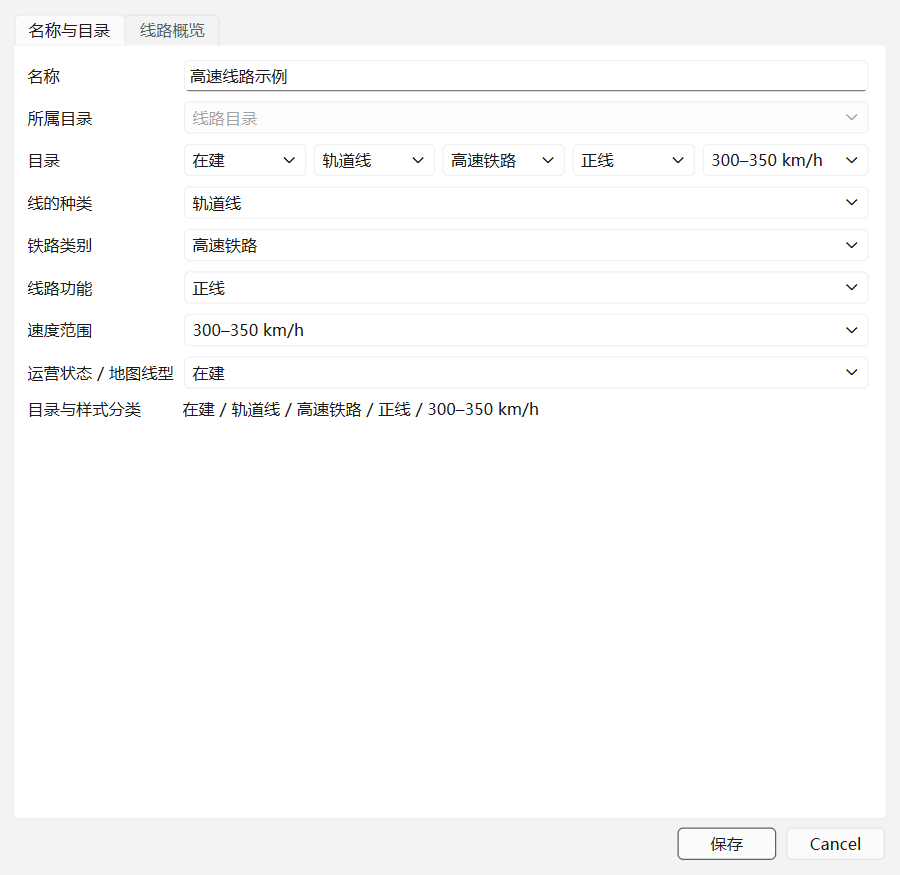

# 国铁目录、状态和站台检查

修改前已独立提交 12 张参考图片：`4473142`。本次修复另作本地提交。

## 怎样改在建线路

在线路目录中右键，选择 **修改运营状态 / 实线虚线 → 在建**。多选后可批量修改。

也可打开 **编辑对象信息 → 名称与目录 → 运营状态 / 地图线型**。这里提供运营中、在建、规划、停用、状态待核实五个选项。原来在线路概览中填写的自由文本状态，只改文字而没有改变地图和运行校验；现在状态写入共享语义字段，目录、地图取数、实线/虚线与运行路径校验同步使用它。在建、规划、停用由专用虚线图层显示，颜色仍按铁路分类匹配。

旧工作区中可识别的状态文字自动迁移为同一字段，原始 OSM 标签不改写。



## 目录、详情和样式怎样对应

默认分类共用 `line_selection`：**线的种类 → 铁路类别 → 功能 → 高速铁路速度范围**。未核实的类别和功能也有明确选项，并可设置样式。

此前目录额外根据线路名称推断“干线”、区域、货运用途，详情和样式没有对应字段。默认目录已去掉这套独立推断。例如同一个对象选择“高速铁路 / 联络线 / 250–300 km/h”，三处使用相同名称和属性。编辑窗口显示当前完整分类，方便核对。

人工指定的自定义文件夹仍是工作区组织位置，保留已有目录移动记录；不会把文件夹名字当作事实，自动更改轨道属性。设施的车站、车场归属仍使用既有稳定 ID。

## 地铁场段为何混入国铁

不少真实场段只标记 `landuse=railway`，没有 `subway=yes`。旧规则漏掉这些对象，还把真实场段面转成国铁目录中的设施点。

已逐个检查 1,481 个场段面以及超过 450,000 条本地 OSM 来源轨道。397 个场段的真实边界内有城市轨道制式证据，从国铁目录和地图国铁设施层排除。石龙路、龙阳路、江杨北路、川沙等场段已验证；北京、广州、武汉等动车段保留。明确的地铁名称、运营单位和场段制式标签也参加过滤。

结果保存在当前数据集的 `rail_transport_context.json`，包含来源、快照、版本、置信度、来源轨道编号及长度。混合制式或缺少证据时保持 mixed/unknown，不根据邻近关系直接删掉设施。原始点、面和轨道保留；以后导入站区时重新生成这份依据。

## 逐站站台检查结果

检查范围是当前本地数据中的 **10,520 个国铁车站/乘降所**，逐一对比来源几何、关联和显示规则。逐站清单见 [CSV](audit/rail-platforms-2026-10-06.csv)，汇总见 [JSON](audit/rail-platforms-2026-10-06.json)。

- 3,074 个站有已关联站台源对象。
- 1,146 个站的已关联站台目前只有线，没有真实面。显示明确标注缺面，保留线几何，不用缓冲区冒充站台。
- 2 个站存在高度重合的重复源面，仅在显示层去重并记录重复来源。
- 1,581 个站台源对象没有可靠车站关联，继续待核验。

上海虹桥有两种错误叠加：

1. 地铁缓存残留 7 个未关联、未核验的虹桥站台面，国铁显示过滤错误地把它们当作地铁设施排除。现在只有明确地铁标签或真实地铁站区成员可以据此排除。
2. 东侧另 5 个面仅因邻近关系被分配给虹桥。它们与名为“虹桥2号航站楼站（市域铁）”的真实车站建筑相交，原始 `stop_area` 关系也指向虹桥2号航站楼。现在不会归入上海虹桥；保留候选建筑和 unresolved 状态。

修复后，上海虹桥的地图、站台关联查询均取得 **16 个真实站台面**。另外 5 个相邻对象保留原始几何，等待独立车站归属核验。

现有数据的关联修正保存在当前数据集的 `rail_platform_associations.json`。每条修正包含来源快照、置信度和几何指纹；源几何变化后不会盲目重放。重新导入时使用修复后的关联规则。人工名称、分类、归属覆盖仍使用原有独立工作区。

本报告验证的是本地源数据、导入关联和显示链路，没有逐站核验实地完整性。原始数据缺失的边界仍需要补充可核验来源。

## 验证与复查

```powershell
$env:PYTHONIOENCODING='utf-8'
$env:PYTHONPATH='D:\RailScope\desktop;D:\RailScope\backend'
python -m pytest desktop/tests -q --basetemp=D:\RailScope\data\processed\test-catalog-alignment-suite-final2
node --test desktop/tests/entity_presentation.test.cjs desktop/tests/history_map_style.test.cjs desktop/tests/infrastructure_history.test.cjs
python scripts/audit_rail_platforms.py
```

完整桌面测试 **408 项通过**；地图增量、历史和样式相关 **10 项 JavaScript 测试通过**。已有 `map_presentation.test.mjs` 动画测试的夹具未载入历史模块，并引用已移除的动画接口；该测试不在本次成功验证范围，文件保持原样。

完整逐站复查若需要重新扫描场段轨道制式：

```powershell
python scripts/audit_rail_platforms.py --refresh-modes data/raw/osm/china-latest.osm.pbf --location-index data/processed/osm/.china-latest.osm.pbf.node-locations.idx
```

完成后重启 RailScope，载入新代码和目录缓存。提交包含代码、测试、检查报告和编辑窗口截图，不包含原始 OSM 或可再生 GIS 输出。
