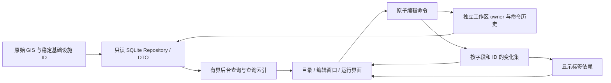

# RailScope 编辑与切换的架构、性能修复

验证日期：2026-10-03。对照代码：`b35615c`。实现分支：`codex/interaction-performance`。

## 已定位的根因与修复

| 根因 | 修复及边界 |
| --- | --- |
| 每次只读查询重建线路工作区 TEMP 表、打开新连接 | `sqlite_read_sessions` 按线程和嵌套深度复用只读连接，工作区只在连接创建时安装。空闲连接不持有事务；异常、取消后清理查询临时表。 |
| 读取单个车站却解析全国车站、反复扫描 24 万条覆盖 | `StationDirectoryIndex` 按需读取；`QueryOverrides` 保存车站、节点和线路别名索引。车站编辑中的人工线路所查询复用同一车站索引。 |
| 首次运行查询再次解析目录已经载入的工作区 | `CatalogWorkspace.cached_values()` 核对工作区身份和全部版本号，复用已载入的 owner 值；外部编辑或替换数据库后返回失效，走原有磁盘校验。 |
| 接轨查询的 UNION 视图执行全国扫描 | 先通过原始索引取得线路编号，再按主键读取有效工作区线路；仍保留原有成员和覆盖规则。 |
| 编辑窗口在 GUI 线程等待接轨和关联查询 | `background_queries` 最多两个工作线程，每个界面/通道只保留最新待执行请求。工作线程只运行数据查询，结果回到 GUI 线程更新；关闭、隐藏界面会取消等待的搜索并丢弃旧结果。 |
| 接轨未载入时保存可能把关系当成空集合 | 载入完成前禁用关系增删，基础属性仍可编辑；保存返回“关系未修改”，保留原有进出站锚点。 |
| 线路基本属性、关联属性分别保存并触发全局刷新 | 相关 owner 变更合并为同一工作区命令、一次本地事务和一次 Undo。用字段及稳定 ID 的变化集通知下游，备注不再触发重建目录/地图/运行计划。 |
| 改一个名称重新遍历停站、构造整张表和运行对象 | `plan_labels` 建立显示依赖，只查改变的车站并更新相关标签。同步 Station 及同名 station OperationalPoint；独立人工运营点名称保留。物理路径、时间、停站 ID 不变。 |
| SQLite 连接跨线程、LRU 被后台和主线程共同修改 | 目录与线路读连接按线程隔离；查询缓存有大小上限，并按源快照及覆盖版本失效。窗口筛选只写自己的 TEMP 表。 |
| 每个目录文件夹都重复执行后代名称查找 | 名称/成员匹配只执行一次，再沿父节点主键生成匹配路径。限制当前目录视图；使用实际 EXPLAIN 结果选择成员表扫描顺序。 |
| 切换线路每次销毁、重建全部列车可见性控件 | 根据运行计划、车次分组、隐藏状态复用控件。新增车次或可见性改变时重建；切换线路复用已有控件。 |
| 站场预览先生成布局，SVG 渲染又重复生成 | renderer 接收已生成的布局。渲染用独立的标注/碰撞检测容器，反复导出不会把 warning 和标注累加进布局。 |
| 单站读取重复解析省界 GeoJSON | 按省界文件快照缓存只读 ProvinceIndex；自定义省界对象独立，文件版本改变后重新建立。 |
| 段场归属判断为每条轨道反复深复制完整来源说明 | 共享 `edge_semantics` 增加值投影，使用同一分类及校验规则。保存和领域 DTO 默认保留完整、独立的 provenance；筛选路径只读取必要属性，仍保留归属自身的来源、版本和核验信息。 |

## 现在的依赖关系



业务对象继续使用 `railscope.domain`。新模块是查询、工作区和显示适配器，没有新增另一套 Corridor、TrainRun 或物理轨道模型。编辑存入 override/workspace；原始 OSM、物理几何和稳定 ID 不会被名称/备注编辑覆盖。

## 真实数据核对

使用 `D:\RailScope` 的全国数据，只读查询约 3.16 GB 的 rail.sqlite、2.70 GB 的 rail_lines.sqlite，及 243,506 条有效覆盖。编辑流程使用 SQLite backup 创建独立副本，复制设置及工作区 sidecar，并核对测试前后的源文件大小和时间戳。

十站：上海虹桥、郑州东、义乌、北京南、南京南、杭州东、广州南、深圳北、武汉、合肥南。线路查询、十站接轨查询、京沪线路搜索的结果校验值全部与旧版一致。这里验证的是查询/编辑架构；站场 SVG 布局复用另有布局和渲染回归测试。

| 查询 | 旧版热查询中位数 | 修复后热查询中位数 |
| --- | ---: | ---: |
| 单线路索引读取 | 1.64 ms | 0.057 ms |
| 十站接轨查询合计 | 60.41 ms | 17.42 ms |
| 京沪线路搜索 | 296.46 ms | 46.67 ms |
| 目录京沪筛选后的计数 | 112 ms | 0.05 ms 左右 |

每项查询运行五次，热查询排除第一轮。目录新筛选准备约 30–33 ms；对照搜索得到相同的 8 / 4 / 1 个顶层目录。线路工作区安装由初步复现中的 339 次降至每个使用的连接一次。首次线路别名建立仍约 247 ms，已经在编辑搜索后台执行。

全国 13,162 个车站的段场归属计算得到同样的 32,803 条记录。带 cProfile 的单次运行约 58.88 s → 15.40 s，归属结果 SHA-256 完全一致。性能分析的调用量约 8,354 万 → 2,875 万（中间版本）；2,000 条完整轨道语义记录的结果校验值也相同。时间受磁盘和操作系统缓存影响，不能把这两个单次运行当成严格的冷盘速度比。

编辑流程的最终测量和校验结果见同目录的 `interaction-performance-measurements.json`。测试覆盖实际 Qt 保存回调、三次车站改名、线路备注/名称/颜色/线宽保存、车站备注及分类保存。必须同时确认数据库已保存、缓存标签已更新、错误列表为空和源数据未变化。

最终隔离编辑复测：首次运行查询准备约 834 ms（前一轮约 3,492 ms），复用约 0.9–1.8 ms；单站读取约 1.8–4.8 ms（前一轮约 74–92 ms）；车站改名保存约 25–30 ms，线路普通属性保存约 15–28 ms。车站分类保存约 202 ms，需要更新分类及可见性。记录时区分这些操作，不把普通属性保存的时间推广到结构变更。

## 回归与适用范围

新增回归覆盖：连接线程与嵌套隔离、只读拒绝写入、异常清理、快照更新、稀疏查询、改名和 Undo、外部工作区修改、后台合并及过期结果、对话框隐藏后的定时器、关系未载入时保存、组合编辑的事务和 Undo、保存失败后的状态、10,000 个停站的局部标签更新、反复线路切换的控件复用、双窗口目录搜索隔离，以及重复 SVG 渲染。

最终同步后的 `D:\RailScope` 主目录完整 pytest：**465 passed，59.10 s**。工作树前一轮完整测试为 463 passed，后续工作区查询适配器新增回归也已通过，并包含在主目录最终完整测试中。新增模块及相关测试通过 Ruff，提交前检查 diff。没有提交原始数据、可再生 GIS、测试数据库副本或 .env。

全国目录的首次重建仍是批处理，最终隔离编辑测试中约 42 s，在已有后台准备流程中显示进度；普通属性保存不会触发这个重建。更改真实归属、拓扑或数据快照仍需要相应重建。

编辑计时使用 MapStub，验证实际 Qt/SQLite 操作，不包含浏览器地图绘制、GPU、真实高负载 TrainRun 仿真，也不能证明任意导入数据都没有卡顿。省界和查询缓存依靠文件快照及工作区版本失效，不通过每次读取哈希全国数据。

## 可复现命令

在项目目录运行，输出落入被忽略的 data/logs：

```powershell
$env:PYTHONUTF8='1'
$env:PYTHONPATH="$PWD;$PWD/backend;$PWD/desktop"
python -m pytest desktop/tests backend/tests -q --basetemp=data/logs/performance-regression
python scripts/benchmark_interaction_queries.py --project D:/RailScope --output data/logs/performance/query.json
python scripts/benchmark_catalog_queries.py --project D:/RailScope --ownership --output data/logs/performance/catalog.json
python scripts/benchmark_entity_edit.py --project D:/RailScope --scratch-root D:/RailScope/data/processed/interaction-benchmark --count 3 --output data/logs/performance/edit.json
```

隔离编辑测试复制完整数据库，临时磁盘需有约 9 GB 可用空间；复制前会检查。脚本关闭只读租约后清理自己的副本。早期失败测试留下的副本位于工作树 `data/processed/edit-benchmark` 和主目录 `data/processed/interaction-benchmark`；清理这些早期副本被自动审批拒绝，交付时单独说明。

本机一轮测试的定时全线程堆栈诊断触发了 Python 解释器访问异常；Windows 应用事件指向 python312.dll，输出停在诊断堆栈中。该计时脚本已移除定时诊断，随后重新完整执行成功。失败的运行不计入性能结论，软件本身没有加入该诊断定时器。
