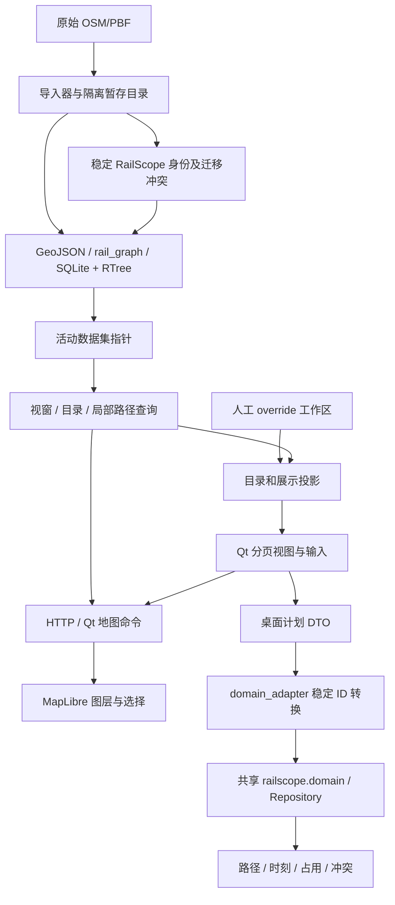

# RailScope 系统审计与修正记录

审计时间：2026-09-29 至 2026-09-30。分支：`codex/system-audit-20260929`。

## 结论与范围

项目已经具备共享领域模型、真实轨道拓扑、稳定身份迁移、SQLite/RTree 视窗查询和分页目录，应该在这些基础上收敛状态与事务。当前运行时并不把原始全国 PBF 当作主要数据库；重新引入另一套 GIS 数据库不能解决现有状态分散问题。

这次已实际修正工作区与交换文件互相覆盖、失败撤销消耗历史、查询持有旧字典、未解析车次漏校验、场景日期混用、hold 错改到达时刻、派生缓存持久化、导入失败半更新、损坏文件被自动保存覆盖、混合拖拽分两次撤销、默认虚假核验状态及数项地图和索引问题。代码按独立阶段提交，原始 OSM 文件未改写。

主要结构债务仍是桌面 `Plan` 与共享 Repository 的双重运行状态、分散的显示/选择状态，以及用户计划和可再生数据的存放边界。下面明确列出证据和后续迁移验收条件；不能把本次修正解释为这些迁移已全部完成。

阅读范围包含 Git 跟踪的 Python、JS/TS、Rust 壳、启动脚本、配置与项目文档。原始清单为 187 个文本文件、42836 行；最终逐文件摘要、Python 导入、长函数、TODO/FIXME/NotImplemented 和异常处理候选见 [source-inventory.json](source-inventory.json)，生成工具为 [audit_codebase.py](../../scripts/audit_codebase.py)。工具完整读取这些文本并解析 Python AST；关键运行链另按调用关系人工检查。清单不代表每一个函数均做过人工语义证明，也不包含原始 PBF、第三方依赖、生成数据或本地密钥文件。

## 1. 启动、依赖与数据流

### 桌面启动

`Start-RailScope.cmd → desktop/Run-RailScope.ps1 → desktop/bootstrap.py → desktop/launcher.py`。启动脚本处理 Python 环境与依赖，bootstrap 准备地图资源；launcher 建立 Qt 主窗口、菜单、目录、运行编辑器、地图通信桥和本地 HTTP 服务。

桌面依赖 PySide6/Qt WebEngine；Python 负责数据查询、编辑与运行计划，浏览器中的 MapLibre 负责几何与标记显示。`desktop/src-tauri` 是保留的打包壳，当前启动命令不走它。Web 示例是独立的 React/Zustand 客户端，调用 FastAPI；后端示例 Repository 目前是内存仓库，PostGIS 迁移脚本存在但不等于桌面已经接入 PostGIS Repository。



共享领域层在 `backend/railscope/domain.py`，Repository 在 `repository.py`，身份与引用校验在 `identity.py`、`integrity.py`。服务层依赖领域和 Repository；领域层不依赖 Qt。桌面 `geometry.py` 复用共享插值，但 `rail_ui.py`、`operating_ui.py`、`launcher.py` 仍承担较多业务编排。

### 导入至运行

国铁 `import_rail.extract` 筛选铁路 Way/设施与必要 Node，在道岔、线路所、共用节点等决策点构造物理区间；源属性和节点保留。IdentityRegistry 迁移为稳定 ID，几何、来源和索引由 `rail_store.build_index` 写入 SQLite。地铁 relation 提取、在建线、站区、道路和服务区走各自导入器和索引适配器。`data_install` 在隔离目录完成导入后切换活动数据集，失败不切换当前指针。

运行阶段按 bbox、缩放、目录/边选择查 SQLite/RTree；地图请求有数量/坐标预算及过期请求抑制，不通过 config 一次发送全国几何。人工改名、归属与分类通过 override 重放，原始派生属性保留。运行路径从所需边组成完整 Corridor，再由具体 TrainRun 定义 stops 和时刻。

仍需关注：首次索引建立和部分目录/在建数据准备会在窗口启动链同步执行；缓存有效时不重新扫描 PBF，缓存失效时的建库延迟仍可能阻塞首次显示。导入器同时持有筛选后的 tracks、points、节点坐标、关系和 edges；全国导入峰值内存尚未实测。

## 2. 业务实体、几何与拓扑

| 概念 | 当前契约与关系 | 审计判断 |
|---|---|---|
| 铁路线路、支线、联络线、在建线路 | InfrastructureLine、LineMembership、NetworkEdge 的线路归属、line_role、construction_status | 分类不应由名字决定；规划/在建不能作为默认正式运营边 |
| 轨道、站场股道、渡线、段管线 | 原子 NetworkEdge；StationTrack 与有向 edge_refs、轨道角色 | 一组股道可以引用多条边，不能复制物理几何充当新轨道 |
| 节点、道岔、线路所 | NetworkNode、OperationalPoint 及 node_ids | 存在实际图连接；普通坐标折点不应无意义拆成运行边 |
| 车站、多 NodeID 车站 | Station、来源成员、节点/站内参考位置、StopPosition | 物理车站与地图 POI 分开；多节点和重复经过要保留路径序号及 offset |
| 站区、站台、站场、车辆段 | StationArea、Platform、Yard、StationZone、StationTrack | 真正轮廓保留来源；没有轮廓不伪造缓冲面 |
| 服务区 POI/AOI | ServiceArea 与 ServiceAreaGeometry | 已有公共实体身份及来源别名，点面不是两个独立服务区 |
| 通道、线路转换、车站进路 | RouteIntent、完整 Corridor、StationRoute | 完整连续有向 edge_refs；自动参考与人工核验必须区分 |
| 车次、停靠与时刻 | TrainService、TrainRun、StopTime、场景事件 | 公众车次服务与运营日实例分开；停站属于 TrainRun |

共享领域引用使用 RailScope ID；原始 OSM Way/Node 是来源与迁移别名。桌面兼容 JSON 和旧 `Plan` 仍使用整数 NodeID、旧站点/线路键；在 `domain_adapter` 边界转为稳定 ID，但这并不等于整个桌面运行状态已经改用领域实体。长期必须让 DTO 留在导入导出边界，UI 持有实体 ID 和视图状态。

`rail_lines` / `rail_line_store` 根据真实共享节点解析线路连接，严格模式遇到多路径保持 unresolved，自动模式保存具体选择、快照及参考状态；最短路径只是几何参考。不能通过同名或地理接近来声称真实联锁连接。导入初始线路身份存在按 name/ref/service 分组的路径，需要进一步验证不连通的同名线路；该风险与后续拓扑目录分组是两层问题。

## 3. 权威状态与派生状态

| 状态 | 当前权威来源 | 派生显示 / 注意事项 |
|---|---|---|
| 原始导入基础设施 | 版本化导入数据与身份库 | RTree、目录、搜索是查询投影，不回写原始 OSM |
| 国铁人工目录编辑 | CatalogWorkspace.values + `data/user_settings/rail_catalog.json` | UI 共享同一份字典；交换文件仅是种子或显式交换 |
| 地铁人工目录编辑 | CatalogOverrides.values + 对应工作区文件 | 更新原字典，避免 StationLookup 指向失效旧值 |
| 共享领域项目 | SQLiteWorkspace 的源对象、override、场景与事件 | EditSession 候选校验成功后提交，载入/Undo 重建派生结果 |
| 占用与冲突 | 时刻、路径、场景事件计算 | 不持久化为权威项目数据；忽略旧文件中的缓存行 |
| 桌面运行编辑 | 旧 Plan + 计划 DTO，领域适配结果 | 尚未统一为 EditSession，属于优先迁移项 |
| 显示、选择、地图标签 | 多个 Qt 状态集合与 JS 地图状态 | 仍需统一 DisplayState / ID 选择解析，不能仅追加 refresh |
| 用户偏好 | 样式、视窗预算、缩放等设置文件 | 与业务计划分开；不改变物理连接或业务身份 |

国铁目录撤销由无 Qt 的 CatalogWorkspace 管理：一次批量修改先验证、原子保存，再发布字典和历史；失败不消耗 Undo/Redo。当前保留最近 30 条内存历史，重启并不恢复这份目录撤销栈。撤销线路聚合时保留 inactive 身份记录，避免旧通道别名悬空。共享领域工作区有另外的事务命令机制；两者尚未统一为全桌面 Command 服务。

## 4. 已复现并修正的问题

| 编号 | 原问题及后果 | 修正与验证证据 |
|---|---|---|
| A01 | 旧目录交换种子再次覆盖新人工编辑；一次编辑写多份文件 | CatalogWorkspace 本地值优先；普通编辑不重写交换文件。`test_catalog_workspace.py` 重启与旧种子回放 |
| A02 | Undo 写入失败时历史已改变，内存/磁盘不一致 | 保存成功后才更新字典和两栈；失败注入验证原数据、磁盘、历史均保留 |
| A03 | 地铁覆盖字典重新绑定，搜索仍持有旧字典 | 原 dict clear/update，查询连续改名和归档立即可见 |
| A04 | 没有 Corridor 的 unresolved 车次跳过时刻/站点校验 | 共享 validate_timetables 总是校验 Stop、起终点、序号、时刻、站台/股道/已核验进路。`test_audit_invariants.py` |
| A05 | 不同运营日车次一起参与占用；闭塞方向忽略成员方向 | 按场景 service_date 过滤，路径方向相对 BlockEdge 计算 |
| A06 | hold 同时延后本站到达，丢失已到站事实 | 保留本站 arrival，延后 departure 和后续 stops；重复站不允许含糊指定 |
| A07 | 重新计算先发布新占用，冲突失败留下新旧混合状态 | 候选计算成功后一起发布；失败注入保持旧占用和冲突 |
| A08 | 身份迁移反复扫描所有旧边；地图框选逐站扫全部别名 | Way/Node 倒排索引；地铁按 physical ID 批量 SQL 查询。`test_identity_audit.py`、`test_audit_queries.py` |
| A09 | 目录路径/搜索中的 %、_ 被解释为 SQL 通配符 | 路径按字面前缀，名称转义特殊字符；分页与子目录查询共用规则 |
| A10 | 全局成对比较不同资源占用；默认 headway rule 未生效 | 按资源类型/ID 分组；专用规则覆盖默认，保留原结果顺序。`test_conflict_audit.py` |
| A11 | Web 切换显隐重复 setData；服务轨道开关没有对应 layer | useMemo 数据与 visibility effect 分离；幂等安装 layers，服务轨道独立显示。`mapLayers.test.ts` |
| A12 | 线段穿过 bbox、没有顶点在 bbox 内时查询漏掉；闭塞只画一条成员边 | 线段矩形相交；所有成员按顺序/方向生成 LineString 或 MultiLineString。`test_api_geometry_audit.py` |
| A13 | 重建虚拟闭塞追加重复成员；碰到手工 ID 时可能部分修改 | 批量检查后发布，幂等生成；冲突明确报错，不覆盖手工定义 |
| A14 | 占用/冲突当作项目状态保存，改时刻和 Undo 后缓存可能陈旧 | 保存排除派生集合，加载旧文件和编辑/Undo/Redo 重算。`test_workspace_cache_audit.py` |
| A15 | 损坏地铁设置被过滤/回退后继续覆盖；共享目录提前失败未锁写 | 严格验证并保留 load_failed；人工操作不能覆盖未成功载入的文件。`test_failed_load_audit.py` |
| A16 | 损坏国铁计划显示回退 G1 后，自动保存覆盖原计划 | 保留载入错误，禁止写回原路径；有效导入后解除保护；可另存 |
| A17 | 国铁共享领域校验失败前已替换 Plan/图层/历史 | document 和 Repository 都由候选构造，成功后再发布；失败保留原对象、历史和播放/地图状态 |
| A18 | 在已多选目录行上右键变成单选 | 仅右键未选中行时改变 current；QTest 模拟真实鼠标操作 |
| A19 | 已保存路径及车次默认升级为 user_verified，丢失参考可信度 | 未声明核验默认 unverified；保留通道 confidence、核验状态和车次来源版本。`test_adapter_provenance_audit.py` |
| A20 | 设施与股道混合拖拽排两个 timer、两次保存/Undo | 无 Qt 的批量归属构造，共用一次工作区提交；一次 Undo/Redo 覆盖两类对象。`test_catalog_batch_audit.py` |
| A21 | 根目录测试依赖临时 PYTHONPATH，三个 launcher 导入失败 | 根 pytest.ini 和 Qt 离屏配置统一测试入口；全套回归验证 |
| A22 | 星号导入隐藏依赖，多个废弃导入/变量 | 改为明确领域导入；清理未使用项，明确公开重导出；保留原生 DLL 导入检查与 QApplication 生命周期 |

提交顺序：`afd9045` 保存任务开始时已有改动；`089197c` 工作区；`147cb55` 时刻与场景；`f384f25` 索引与查询；`56dde1a` Web 图层；`5d674e2` 项目缓存与闭塞；`4c3c922` 保存保护与导入事务；`5f11799` 多选；`a3270dc` 核验来源；`38fb876` 混合批量命令。静态清理及报告随后独立提交。

## 5. 按运行模块复核

| 范围 | 当前机制 / 判断 | 剩余工作 |
|---|---|---|
| 目录树 | 国铁、地铁、道路主要视图已用 SQLite + QAbstractItemModel/QTreeView，128 项分页；国铁旧辅助树限 512 项 | station_catalog 某些归属编辑仍整体生成投影；部分编辑器完整建树；地铁层级仍按省/市/线组织 |
| 地图 | RTree 视窗与显式 edge/group 选择；MapLibre source/layer 分开；Node 和标签已有共线站点显示过滤 | Qt 主开关、排除集、设施/站点可见集与 JS visibility 多处维护；需要统一纯显示策略及其测试 |
| 选择/属性 | 地图对象有实体/来源属性，目录选择通过索引反查；框选批量反查已修正 | 属性面板和 selected_features 保存 properties 快照；编辑后应按稳定 ID 重新解析，删除后清空无效引用 |
| 搜索 | SQLite 目录和实体别名索引，改名更新展示标签；路径特殊字符已修正 | 子串 LIKE 可能扫投影；没有全局统一搜索服务，需基于实际规模评估 FTS，不复制全国对象到新 Python Registry |
| PBF/缓存 | 筛选提取、阶段缓存、轻量 SQLite/RTree、活动快照、查询预算已经存在 | 多次 PBF 扫描、relation 展开、selected 数据峰值内存、首次同步建库需全国数据实测 |
| 铁路拓扑 | 原子边、真实节点、稳定身份、连续方向校验、旧边迁移 conflict、引用检查 | 不连通同名线路初始身份分组需专门案例；任意用户端点切分必须迁移所有引用 |
| 国铁/地铁共用 | 领域、身份和插值可共用；地铁运行只开放上海 | 桌面两个运行编辑链仍有独立 DTO 编译与重复 profile 几何，应以共享 Corridor 缓存收敛 |
| 运行图 | Plan 的 stops 驱动表格、图线与动画；跨日用运营日累计秒，通过节点可同到发时刻 | DTO/Repository 双状态；共享仿真每次线性遍历边并重复累计距离；缺少统一路径版本缓存 |
| 占用/冲突 | 场景派生、日期隔离、成员方向、默认规则和事务已修正 | 占用是区间线性近似；仅另算站内股道停站占用，尚无完整停站闭塞占用/列车长度释放模型；opposite_direction_min_s 非重叠规则未实现 |
| 保存/交换 | 严格 JSON、原子写入、损坏载入保护、JSON 无损交换；CSV 不支持的字段明确拒绝 | 历史 plan 和 workspace.sqlite 默认落在 processed/operations；地铁编辑与目录历史尚未统一项目事务 |
| Qt 事件/线程 | 解析/安装/分类部分走 worker，Qt signal 回主线程；HTTP 断连与窗口已关闭有明确边界处理 | 首次索引部分同步；耗时子进程中途取消粒度和长时间 GUI 响应尚未实测；需要测 refresh 次数再统一事件入口 |
| 错误/兼容 | AST 全仓库候选 + Ruff F 检查；兼容 bare/relative 导入支持直接桌面启动 | canonical_repository 中读取坏目录 metadata 的 OSError/ValueError continue 仍会丢失覆盖语义；需区分缺失与损坏并展示 conflict |
| 空数据/缺失引用 | 空项目、缺少数据、无效物理路径、丢失引用、损坏计划、失败写入有测试 | 完整 GUI 的重复选择→编辑→删除→Undo 链及重新导入后的多窗口状态需实机验证 |

未把 `pass` 全部删掉：17 个全 pass 异常处理候选逐个检查，其上下文包括原生 Windows 临时映射清理、客户端断连、可再生索引重建、关闭窗口后信号、展示/来源解析回退。它们不等同于吞业务失败；源码清单另列出 broad/suppressed handlers 供复核。`ScheduledTrainStateProvider`、`ManualDispatchSolver` 等是未启用的扩展骨架，不能宣称已经实现自动调度。

## 6. 尚需迁移的结构债务

以下 P1/P2 是工程优先级，不表示已证实所有用户数据都受影响。

### P1：用户文件位置与身份寿命

证据：`launcher.py` 的默认 metro/rail plan 在 `data/processed/operations/`；`RailEditor.workspace_identity_path` 和 `rail_way_names.json` 也沿用计划父目录。清理可再生数据可能误伤人工计划及稳定别名。

迁移应把计划、身份和人工命名移至明确项目/workspace 位置：先备份与校验内容及引用，再幂等复制迁移，验证重启/重新导入后 ID 不变，保留旧路径恢复记录。SQLite 需正确处理 WAL 和未提交事务。此次未移动或删除用户已有数据。

### P1：桌面运行唯一状态与命令

证据：`operating.Plan`、`RailEditor.rail_payload/base_lines/graph`、`domain_repo` 同时存在；部分 edit callback 编译、改字典、刷新 widget。此次修复候选导入发布顺序，不等于每种桌面编辑都进入共享 EditSession。

下一步以 Repository/EditSession 为唯一运行状态，保留旧计划格式为 DTO adapter。目录、运行图、表格、模拟器只读 ID 投影；车次不复制 Corridor geometry。每类命令逐步迁移并做旧/新结果对照，完成之前保留旧 API。验收：任一停站/通道/股道修改后，表格、图线、动画、保存、Undo 引用同一版本；一次业务操作一次撤销。

### P1：覆盖损坏、同名对象与来源可信度

证据：领域适配器对目录 metadata 仍有静默 continue；IdentityRegistry 初始线路名/ref 分组可能合并不连通同名轨道。默认核验升级已修正，但每种人工修改是否使旧核验过期仍需统一规则。

后续分别建立损坏覆盖恢复、重复线名断开组件、同名站多 NodeID、快照拆边后全引用迁移的回归。目录展示名称不承担身份职责；不能用临时新 ID 隐藏冲突或默默忽略损坏文件。

### P2：显示策略、选择与目录增量更新

把 visibility、selection、geometry version 和 style version 放在独立显示状态服务，按实体关系一次计算站点/标签/节点可见性。UI 输入提交状态变化，地图和目录订阅同一投影。属性面板按实体 ID 解析，删除/Undo 后重新取得对象，避免捕获旧 properties。

station_catalog 按影响实体更新 SQL 行；目录只发对应 model 变更，不完整重建。展示去重继续保留原始来源节点。全国搜索先测延迟/行数，再选择 FTS 或局部索引。

### P2：规模与运行仿真边界

测量冷启动、缓存启动、全国导入耗时/峰值 RSS、各阶段数量、视窗请求 SQL/序列化时间、目录展开量和 Qt 主线程最长阻塞。再决定流式写库、减少重复扫描、几何缓存或瓦片；当前没有理由先新增完整 GeoPackage/PostGIS 运行基础设施。

共享仿真路径的累计距离/边查询可按 Repository 版本和 Corridor ID 缓存；边修改后失效。占用与冲突要补停站闭塞、列车长度和反向间隔模型，并继续标明参考仿真，不声称真实调度/联锁安全。

## 7. 验证、性能与限制

### 可复现入口

```powershell
# 仓库根目录；pytest.ini 已设置模块路径，conftest 默认 Qt 离屏
python -m pytest backend/tests desktop/tests -q -p no:cacheprovider --basetemp .audit-local
python -m ruff check backend desktop scripts --select F
node --check desktop/assets/map.js
node --check desktop/assets/map-export.js
node --check desktop/assets/vehicle-motion.js
node desktop/tests/road_layers.cjs
node desktop/tests/vehicle_motion_test.cjs

# frontend 目录
npm test -- --run
npm run build

# 仓库根目录；只使用临时合成数据，不接触实际 PBF
python scripts/benchmark_identity.py --before-ref 147cb55 --count 2000 --output .audit-benchmark.json
python scripts/audit_codebase.py --output .audit-source-inventory.json
```

原始默认根测试 157 通过、3 项 launcher 导入失败；正确设置路径时原有 160 项通过。修正后 Python 全套 201 项通过，Web 3 项通过，TypeScript/Vite 生产构建通过，地图 JS 语法与道路/车辆 Node 回归通过，Ruff F 类通过。Vite 仍提示大 bundle；并未通过拆包消除该提示。测试数量和入口以此次记录为准，不用历史 100 项说明代表当前验证。

边界回归涵盖：空数据、缺少引用、源节点/平台/道岔导入、非运营边、严格多路径、同名对象来源区分、多节点站与股道归属、跨午夜累计时刻、通过不停、连续改名、批量目录移动、Undo/Redo、写盘失败、损坏文件、旧种子重载、场景日期、未核验进路、派生缓存重建。测试主要是局部 OSM XML、临时 SQLite、Qt 离屏和合成运行仓库，不是全国 PBF 端到端压力测试。

身份迁移合成基准记录见 [identity-benchmark.json](identity-benchmark.json)：2000 条直线边、全部源 ID 替换，旧匹配 1.461775 秒，倒排索引后 0.061478 秒，约 23.78 倍。只说明这个候选匹配场景，不代表完整 PBF 导入、启动或所有路径都同倍提速。

未验证：真实全国约 1.5 GB PBF 的完整导入与内存峰值、在线底图/GPU/Qt WebEngine 实机交互、长时间播放、用户现有全部计划重新导入迁移、PostGIS Repository 的生产连接。未批量重写用户计划、身份库、原始或 processed GIS 数据。最终 Git 差异必须只含小型代码/测试/文档及明确的任务开始前目录/CSV 改动。
