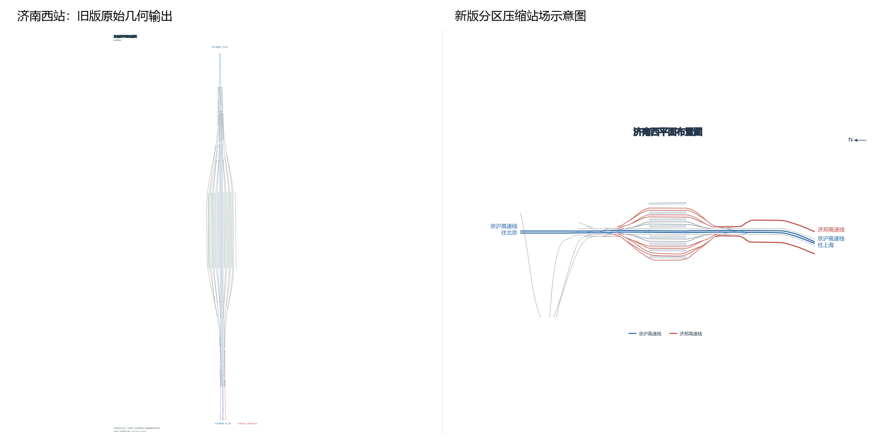
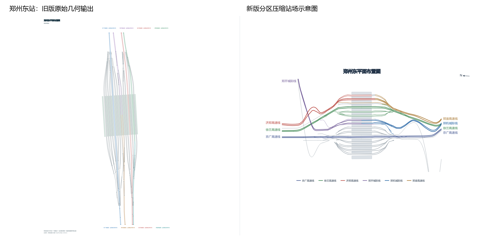
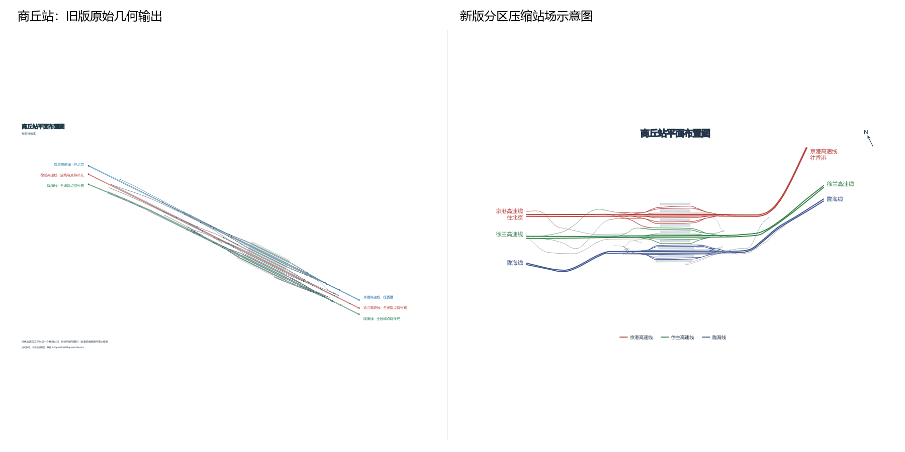
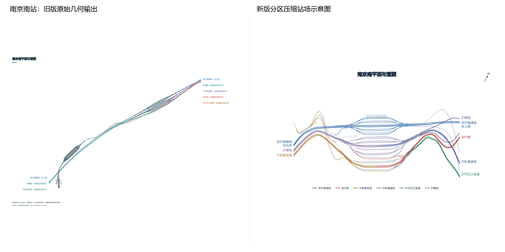
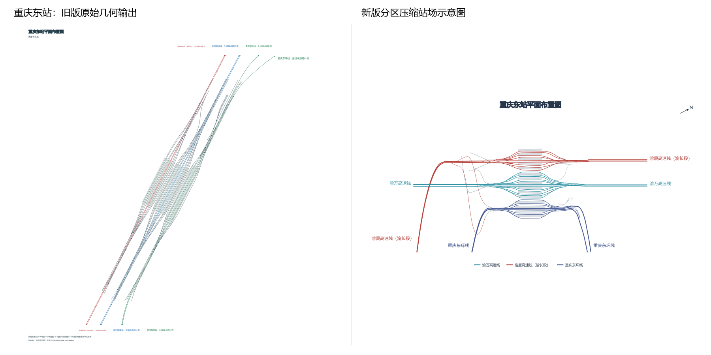
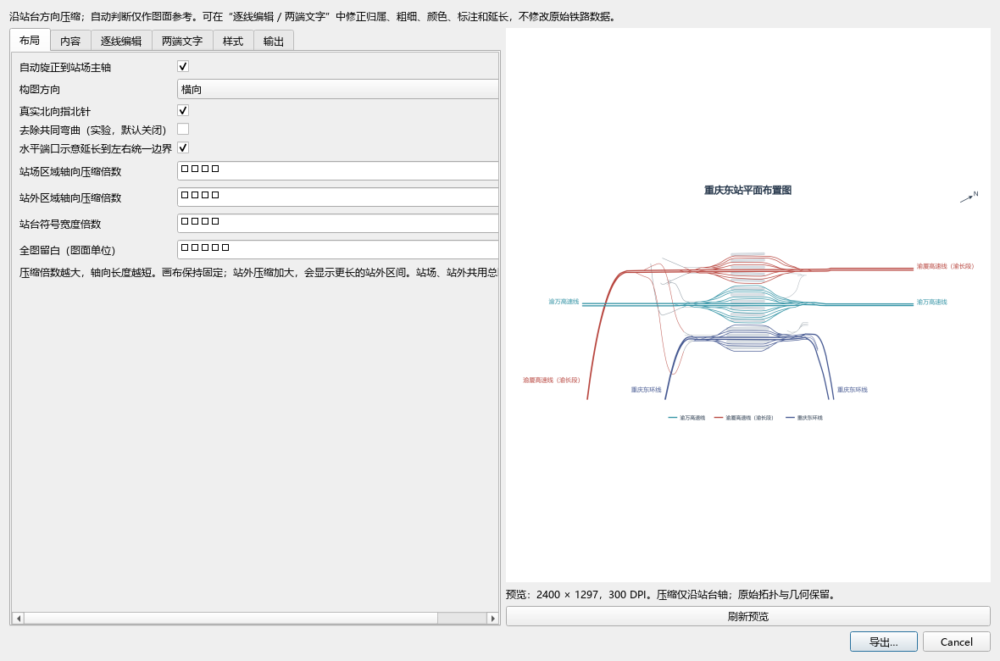
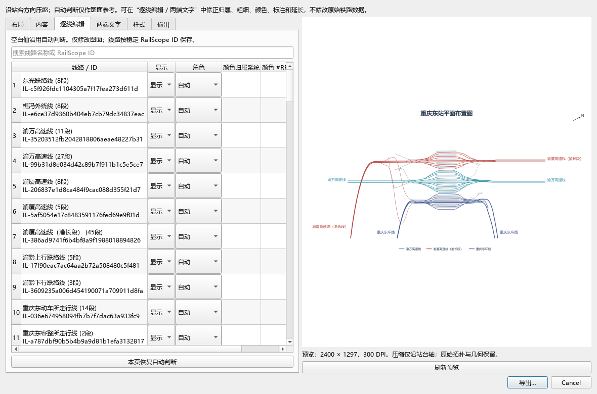
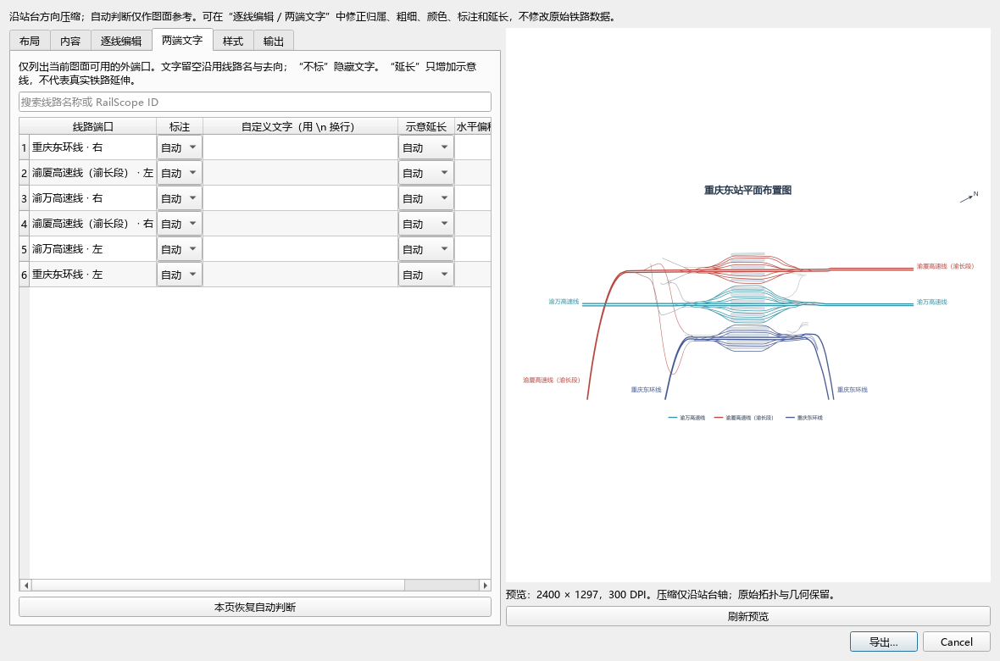

# 五站导出 benchmark

左侧旧版，右侧新版。所有图来自同一套本地真实拓扑；完整参数和结构检查见 `manifest.json`。

每站 `after.svg / after.png / after.pdf` 为默认结果；`common-bend-on / common-bend-off`、`outside-12`、`construction`、`outlet-extension-off` 为参数变体。共同弯曲默认关闭；渝万左侧支持图面延长；向上 / 下出界端口默认不横向延长。

南京南源关联数据仅有 1 个站台轮廓，未补造其他站台。自动判断不确定的颜色归属和去向，可在编辑界面修正。

复现：在项目根运行 `python scripts/export_station_diagram_examples.py`。说明见根目录 `STATION_DIAGRAM_REFACTOR.md`。
